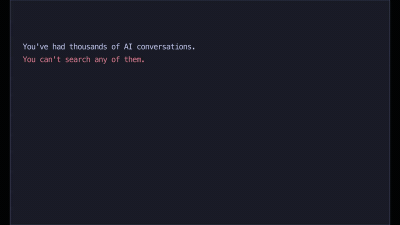

# 🧠 brain-mcp

**The first SHELET-compliant MCP server.** A cognitive prosthetic for AI agents — 25 stratified tools with structural citation discipline over your own conversation history.

*Other AI memory tools remember facts. brain-mcp remembers how you think — and proves where each claim came from.*

[](https://pypi.org/project/brain-mcp/)
[](https://pypi.org/project/brain-mcp/)
[](https://github.com/mordechaipotash/brain-mcp/stargazers)
[](LICENSE)
[](https://brainmcp.dev)
[](https://pypi.org/project/brain-mcp/)

<p align="center">
  
</p>

<p align="center">
  <b><a href="https://brainmcp.dev">📚 Site</a></b> ·
  <b><a href="https://brainmcp.dev/docs/quickstart">🚀 Quickstart</a></b> ·
  <b><a href="https://brainmcp.dev/for-ai">🤖 For AI</a></b> ·
  <b><a href="docs/adr/001-shelet-reference-implementation.md">📐 SHELET ADR</a></b> ·
  <b><a href="CHANGELOG.md">📜 Changelog</a></b>
</p>

---

> **🤖 AI assistant?** You have access to your human's conversation history. Read the [instructions for you](#-for-ai-assistants) first — they'll make you dramatically more useful.
>
> **👤 Human?** Skip to [what this is](#-for-humans), [install](#install), or [the SHELET architecture](#the-shelet-architecture).

---

# 🤖 For AI Assistants

*Your human installed brain-mcp and gave you access to their conversation history. Here's the contract.*

## When to search their brain

| Your human says… | You should call… | Why |
|---|---|---|
| "Where did I leave off with…" | `tunnel_state(domain)` | Reconstructs their mental save-state for that domain with citations |
| "What do I think about…" | `what_do_i_think(topic)` | Synthesizes their views across 10+ conversations, with citations |
| "I was working on something about…" | `semantic_search(query)` | Finds conversations by meaning, not just keywords |
| "What did I do last week?" | `conversations_by_date(date)` | Browse by time |
| "I keep forgetting to…" | `open_threads()` | Surfaces everything unfinished across all domains |
| "Should I switch to…" | `switching_cost(current, target)` | Quantified cost (0.0–1.0) with a recommendation |
| "Am I being consistent with my principles?" | `alignment_check(decision)` | Surfaces relevant principles + past thinking — user decides |
| *Starting any new topic* | `semantic_search(topic)` | Check if they've thought about this before |
| *They seem stuck or repeating themselves* | `thinking_trajectory(topic)` | Show how their thinking evolved — they may have already solved it |

## Citation discipline (the SHELET contract)

Every output from an L2 or L3 tool carries **structural citations** — inline `[conv_id · YYYY-MM-DD]` markers tying every claim back to a specific conversation. This is not decoration. **Use them.** When you surface an insight from brain-mcp, keep the citation visible so the human can drill back to the source.

**Correct:**
> You decided in March to focus on B2B first `[cc_local_abc123 · 2026-03-12]`, though you revisited this in April `[clawdbot_xyz789 · 2026-04-05]`.

**Wrong:** *(drops the trail, human can't verify)*
> You decided to focus on B2B first, though you revisited this later.

## How to present results

**Do:**
- **Synthesize.** "You explored this across 8 conversations and landed on X" — never dump raw search results.
- **Be specific.** "In your March 12 conversation `[conv_id · 2026-03-12]`, you decided to focus on B2B first."
- **Surface contradictions.** "You said X in January but Y in March — want to reconcile?"
- **Connect dots.** "This relates to what you figured out about pricing last month."

**Don't:**
- Don't mention "brain-mcp" by name — just use the context naturally
- Don't search for every single message — only when context would genuinely help
- Don't strip citations from your output
- Don't overwhelm — 2–3 relevant findings beat 15 raw results

## Progressive capability

brain-mcp degrades gracefully. Different installs have different layers available:

- **L0 only (just conversations)** → keyword search, date browsing, basic stats
- **+ L1 (embeddings)** → semantic search, cross-conversation discovery
- **+ L2 (summaries)** → full structured synthesis with thinking stages, decisions, open questions, citations

If an L2 tool returns a `_SUMMARIES_HINT` footer, tell the human they can unlock the rich tools by running `brain-mcp summarize` (requires an LLM API key).

<details>
<summary><b>All 25 tools, stratified by SHELET layer →</b></summary>

| Layer | Tool | Purpose |
|------|------|---------|
| **L0** raw | `brain_stats` | Counts of messages / embeddings / summaries / domains |
| **L0** raw | `trust_dashboard` | Structural integrity check — the safety-net proof |
| **L0** raw | `get_conversation` | Full thread by ID (the citation terminus) |
| **L1** retrieval | `semantic_search` | Vector similarity over messages |
| **L1** retrieval | `search_conversations` | Keyword (ILIKE) search |
| **L1** retrieval | `search_summaries` | Hybrid retrieval over L2 structures with filters |
| **L1** retrieval | `search_docs` | Markdown corpus search with depth/energy filters |
| **L1** retrieval | `unified_search` | Cross-source: conversations + GitHub + markdown |
| **L1** retrieval | `conversations_by_date` | Temporal browse |
| **L2** synthesis | `tunnel_state` | Domain save-state with cited open questions + decisions |
| **L2** synthesis | `context_recovery` | Full re-entry brief (longer, deeper than tunnel_state) |
| **L2** synthesis | `what_do_i_think` | Opinion synthesis (synthesize or precedent mode) |
| **L2** synthesis | `thinking_trajectory` | Evolution over time (full / velocity / first view) |
| **L2** synthesis | `what_was_i_thinking` | Monthly snapshot |
| **L2** synthesis | `unfinished_threads` | Open questions at summary granularity |
| **L2** synthesis | `cognitive_patterns` | How you think — patterns and breakthrough correlates |
| **L3** fusion | `dormant_contexts` | Abandoned domains ranked by breakthrough density |
| **L3** fusion | `open_threads` | Global unfinished-work matrix, domain × questions |
| **L3** fusion | `switching_cost` | Quantified 0.0–1.0 cost + recommendation |
| **L3** fusion | `alignment_check` | Principles × past thinking — user interprets |
| **utility** | `tunnel_history` | Aggregate engagement profile (bar charts) |
| **utility** | `github_search` | Cross-reference repos + commits |
| **utility** | `query_analytics` | Timeline / stacks / spend / problems (optional parquets) |
| **utility** | `list_principles` | List user's stated principles from YAML |
| **utility** | `get_principle` | Retrieve one principle by name |

Every L2/L3 tool has a [SKILL.md manifest](.claude/skills/) declaring its layer, reads, writes, citations, and determinism. Those manifests are part of the SHELET governance contract — `make verify-skills` validates them in CI.

</details>

---

# 👤 For Humans

## The problem brain-mcp actually solves

You had a breakthrough at 2am last Tuesday. You laid out a whole framework in a conversation with Claude. It was brilliant.

You can't find it. You can't even remember which conversation it was in.

**Every week, millions of people pour their best thinking into AI conversations — and lose all of it.** ChatGPT's "memory" stores a few fun facts. None of them let you *search your own thinking*.

The real cost isn't forgetting. It's the **anxiety of knowing you'll forget.** Every time you go deep on a problem, part of your brain is mourning the other threads you're abandoning. brain-mcp eliminates that. Your threads survive. You can go deeper.

### Without brain-mcp
> *"I had this great idea about the business plan last month… which conversation was it… was it ChatGPT or Claude…"*
> 30 minutes later: maybe 60% recovered, if you're lucky.

### With brain-mcp
```
> "Where did I leave off with the business strategy?"

## 🧠 Tunnel State: business-strategy

**Current stage:** crystallizing
**Emotional tone:** focused
**Conversations:** 15 (last 10)
**Breakthroughs:** 2 💎
**Cognitive pattern:** connecting-domains

### ❓ Open Questions (12)
  - Should I focus on B2B or B2C first? [cc_local_abc123 · 2026-03-12]
  - What pricing model fits the early stage? [clawdbot_xyz789 · 2026-03-18]
  - Open-source or commercial license? [cc_local_def456 · 2026-04-02]

### ✅ Decisions (8)
  - Target solo developers initially [cc_local_abc123 · 2026-03-12]
  - Open-source core, paid hosting layer [clawdbot_xyz789 · 2026-03-18]

### 🏷️ Active Concepts
  pricing, distribution, ADHD, SHELET, monotropic focus, indie-hacker, GTM

### 📎 Sources (10)
  - Q1 strategy deep-dive [cc_local_abc123 · 2026-03-12]
  - Pricing brainstorm [clawdbot_xyz789 · 2026-03-18]
  - B2B vs B2C framework [cc_local_def456 · 2026-04-02]
  … (7 more)
```

Your AI reconstructs the mental state that took weeks to build — **and every claim is traceable to source.** No hallucination surface.

---

## Install

```bash
pipx install brain-mcp
brain-mcp setup
```

That's it. `setup` discovers your conversations, imports them, creates local embeddings, and configures your AI tools.

Then restart your AI client and say **"use brain"** in any conversation.

<details>
<summary><b>pip install / per-client options</b></summary>

```bash
pip install brain-mcp
brain-mcp setup
```

Configure specific clients:

```bash
brain-mcp setup claude     # Claude Desktop + Code
brain-mcp setup cursor     # Cursor
brain-mcp setup windsurf   # Windsurf (uses Cursor ingester pattern)
```

</details>

<details>
<summary><b>Unlock the L2 synthesis tools (optional)</b></summary>

The prosthetic tools (`tunnel_state`, `context_recovery`, `what_do_i_think`, etc.) work on L2 summaries. Generate them with:

```bash
export ANTHROPIC_API_KEY=...        # or OPENAI_API_KEY or OPENROUTER_API_KEY
brain-mcp summarize
```

A full pass costs ~$3–5 for a 26K-summary corpus using Gemini 2.5 Flash Lite via OpenRouter. The prompt ships inside the package — no external dependencies.

</details>

---

## Supported sources

Auto-detected during `brain-mcp setup`:

| Source | Status |
|---|---|
| Claude Code | ✅ Native ingester (reads `~/.claude/projects/**/*.jsonl`) |
| Claude Desktop | ✅ Native ingester (macOS / Linux / Windows paths) |
| ChatGPT export | ✅ Native ingester (`conversations.json`) |
| Cursor | ✅ Native ingester (SQLite state + agent transcripts) |
| Clawdbot | ✅ Native ingester (`~/.clawdbot/agents/**/sessions/*.jsonl`) |
| Gemini CLI | ✅ Native ingester |
| Windsurf | ⚙️ Uses Cursor's storage layout — works via the Cursor ingester |
| Generic JSONL | ✅ Write any exporter to match the generic schema |

---

## How it works

1. **Install** — 30 seconds, one command.
2. **It finds your conversations automatically** — Claude Code sessions, ChatGPT exports, desktop app logs. Already on your machine.
3. **Your AI searches your brain** — sub-second queries against local DuckDB + LanceDB, citations included.

All data stays on your machine. The embedding model runs locally (fastembed) or via an API key you provide (OpenRouter). **No cloud by default. No mandatory accounts.**

### Sync

**New conversations are picked up by running `brain-mcp sync` manually.**

In v0.3.x, sync ran automatically on server startup and periodically during tool calls. We disabled that in v0.3.1 because historical imports from external sources (ChatGPT exports, Claude Desktop archives) can't be re-synthesized from disk — an aggressive auto-sync clobbered them. Manual sync is the contract now. Your call when to run it.

---

## The SHELET architecture

brain-mcp is the reference implementation of **SHELET** (Stratified Human-Engaged Leverage Enhancement Technology) — a governance protocol for AI systems that preserves human agency by making every synthesis traceable to its source.

### The four layers

| Layer | Role | Examples in brain-mcp |
|---|---|---|
| **L0** | Raw, immutable artifacts. INSERT-only. | `all_conversations.parquet` — every message you've ever sent/received |
| **L1** | Deterministic extractions. Pure function of L0. | LanceDB embeddings, keyword indexes |
| **L2** | LLM synthesis. **Citations required.** Temporal. | `brain_summaries_v6.parquet` — structured decisions, open questions, concepts |
| **L3** | Fusion. Route-to-attention. **Not compress-further.** | `dormant_contexts`, `switching_cost`, `alignment_check` outputs |

### The governing rule

> *L0 is immutable. Each layer is a pure function of the one below. Every higher-layer claim carries a citation to the layer below.*

This isn't convention — it's **enforced**:

- [Migration 003](supabase/migrations/003_shelet_l0_to_l3.sql) encodes the rule as SQL `CHECK` constraints: L2 rows cannot be inserted without non-empty citations JSONB. RLS policies prevent an L3 tool from writing to L0.
- `brain.resolve_citations(l3_id)` is a recursive SQL function that walks L3 → L2 → L1 → L0, returning every source message behind any fusion.
- `.claude/skills/*/SKILL.md` — 25 declarative manifests, one per tool, specifying `layer`, `reads`, `writes`, `citations`, `determinism`, and explicit "Does NOT do" boundaries.
- [`make verify-skills`](scripts/verify_skills.py) validates every manifest in CI against 8 invariants.

### Why this matters for AI consumers

When Claude calls `tunnel_state("auth-refactor")`, it doesn't just get prose. It gets synthesized output where **every claim carries a citation back to the underlying conversation**. The AI cannot fabricate decisions because the citation chain is structural. One SQL call (`brain.resolve_citations`) walks L3 → L2 → L1 → L0 and returns every source message.

### Want to go deeper?

- [ADR-001 — SHELET reference implementation](docs/adr/001-shelet-reference-implementation.md) — full rationale + stratification table + 7-day sprint plan
- [ADR-002 — Supabase canonical backend](docs/adr/002-supabase-canonical-backend.md) — multi-tenant path (deferred to v0.5.0)
- [Migration 003 — L0-to-L3 schema](supabase/migrations/003_shelet_l0_to_l3.sql) — optional, off by default

---

## Compared to…

| | brain-mcp | mem0 | Letta / MemGPT | Zep / Graphiti | Rewind | Obsidian RAG | Official MCP memory |
|---|---|---|---|---|---|---|---|
| Local-first by default | ✅ | ⚠️ cloud-first | ✅ | ⚠️ self-host needs Neo4j | ✅ | ✅ | ✅ |
| Ingests existing conversation history | ✅ all 6 sources | ❌ agent-turn only | ❌ agent-owned | ❌ agent-owned | 🎙️ screen+audio | ❌ vault-only | ❌ manual |
| Cognitive-prosthetic tools | ✅ 8 prosthetic + 4 L3 fusion | ❌ | ❌ | ❌ | ❌ | ❌ | ❌ |
| Structural citations | ✅ L2/L3 required | ❌ | ❌ | ⚠️ temporal only | ❌ | ❌ | ❌ |
| Layer-bounded permissions | ✅ RLS + skill manifest | ❌ | ⚠️ OS-metaphor | ⚠️ graph edges | ❌ | ❌ | ❌ |
| AI-first docs | ✅ `/for-ai` page + SKILL.md | ❌ | ❌ | ❌ | ❌ | ❌ | ❌ |
| Price | free (MIT) | $19–249/mo | free OSS | $25–475/mo | $19–29/mo | free + sub | free |

**The one-line frame:**
> Mem0 personalizes your agent. Letta makes your agent stateful. Zep gives your agent a knowledge graph. **brain-mcp gives *you* a cognitive prosthetic** — with the only structural citation discipline in the category.

---

## 🔒 Privacy

- **100% local by default** — all data stays on your machine
- **No cloud dependency** — works offline after setup
- **Open source** — audit every line ([MIT licensed](LICENSE))
- **Anonymous telemetry** — event name + latency + anonymized machine ID only. Zero conversation content. Opt-out: `brain-mcp telemetry off`. [Schema + RLS](supabase/migrations/001_telemetry.sql).

**Env-var opt-outs respected:** `DO_NOT_TRACK=1`, `BRAIN_MCP_TELEMETRY=0`, `CI=true`.

---

## FAQ

<details>
<summary><b>Does brain-mcp send my conversations anywhere?</b></summary>

By default, no. All indexing runs locally with `fastembed`. The only outbound traffic is anonymous telemetry (event name + latency, no content — opt-out one command). If you set `OPENROUTER_API_KEY`, embeddings route through OpenRouter — that's the one case where content leaves your machine, and it's explicit opt-in.
</details>

<details>
<summary><b>What's SHELET and why should I care?</b></summary>

SHELET (Stratified Human-Engaged Leverage Enhancement Technology) is a governance protocol that makes AI synthesis *traceable*. When your AI tells you "you decided X in March," it's not paraphrasing from memory — it's returning a claim with a citation back to the exact conversation. No hallucinated decisions. Full audit chain. See [ADR-001](docs/adr/001-shelet-reference-implementation.md).
</details>

<details>
<summary><b>How does this differ from mem0 / Letta / Zep?</b></summary>

They're **agent-personalization** tools — they help your agent remember facts between turns. brain-mcp is a **cognitive prosthetic** — it helps *you* remember what *you* thought across months of conversations, with citations. Different problem, different category. See the [compared-to table](#compared-to).
</details>

<details>
<summary><b>Can I use a different embedding model?</b></summary>

Yes. Edit `embedding:` in your `brain.yaml`:

```yaml
embedding:
  provider: fastembed                         # default, local
  model: BAAI/bge-small-en-v1.5                # 384-dim, ~107MB
```

Alternatives: `sentence-transformers` (local, 768-dim), `openrouter` (remote, any OpenAI-compatible embedding model).
</details>

<details>
<summary><b>What if I haven't run summarize — do any tools work?</b></summary>

Yes. The L0/L1 tools (search, stats, browse) work immediately after `brain-mcp setup`. The L2/L3 prosthetic tools gracefully fall back to raw-conversation keyword expansion when summaries are absent, appending a footer telling you to run `brain-mcp summarize` for richer output.
</details>

<details>
<summary><b>How do I update?</b></summary>

```bash
pipx upgrade brain-mcp
# or
pip install -U brain-mcp
```

Your indexed data carries across upgrades. If an embedding-model change requires a re-index, `brain-mcp sync --full` handles it.
</details>

<details>
<summary><b>Can I run brain-mcp as a shared / multi-tenant service?</b></summary>

Not yet on the Python side. The [Supabase canonical schema](supabase/migrations/003_shelet_l0_to_l3.sql) ships with tenant-scoped RLS ready to go. The Python adapter that uses it is [deferred to v0.5.0](docs/adr/002-supabase-canonical-backend.md).
</details>

<details>
<summary><b>How do I contribute a new source ingester?</b></summary>

Write a class that inherits `BaseIngester`, decorate it with `@register`, drop it in `brain_mcp/ingest/your_source.py`. That's the whole surface. Registry is auto-discovered at import time. See [brain_mcp/ingest/generic.py](brain_mcp/ingest/generic.py) for a minimal reference.
</details>

---

## Requirements

- Python **3.11+** (3.12 and 3.13 also supported)
- macOS, Linux, or Windows
- ~300 MB disk for 100K messages with embeddings
- Optional: an LLM API key for L2 summarization (Anthropic / OpenAI / OpenRouter)

---

## Contributing

See [CONTRIBUTING.md](CONTRIBUTING.md). If you're adding a new skill, [ADR-001](docs/adr/001-shelet-reference-implementation.md) explains the SHELET manifest contract. `make verify-skills` is the CI gate.

---

<div align="center">

*Built because losing your train of thought shouldn't mean starting over.*

**[brainmcp.dev](https://brainmcp.dev)** · **[PyPI](https://pypi.org/project/brain-mcp/)** · **[Changelog](CHANGELOG.md)** · **[SHELET ADR](docs/adr/001-shelet-reference-implementation.md)**

⭐ If this is useful, a star helps others find it.

</div>
